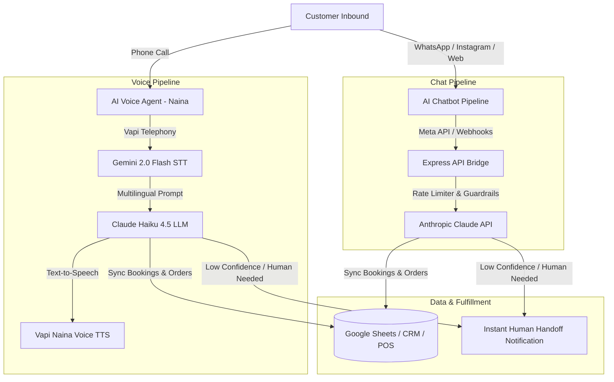

# AgentIQ — Done-for-You AI Chatbots & Voice Agents for Indian Businesses

[](https://agentiq.co.in)
[](https://agentiq.co.in)
[](https://agentiq.co.in)
[](https://agentiq.co.in)

> **AgentIQ** is a managed AI automation agency building production-grade **WhatsApp chatbots**, **Instagram automation**, **website chat widgets**, and **multilingual AI voice agents** (English, Hindi, and Hinglish) for Indian restaurants, clinics, salons, and D2C brands.

---

## ⚡ Key Highlights & Capabilities

- **🚀 Live in 7 Days (Done-for-You):** Unlike self-serve DIY platforms (WATI, AiSensy, Interakt), AgentIQ custom-builds, trains, tests, and deploys the entire AI system with zero coding required from the client.
- **🎙️ Voice Agent Pipeline ("Naina"):** Real-time conversational phone receptionists powered by Vapi, Google Gemini 2.0 Flash (Multilingual transcriber), and Claude Haiku 4.5.
- **💬 Omnichannel AI Chatbot:** Unified assistant replying across WhatsApp (Official Business API), Instagram DMs, and embeddable Web Chat.
- **🇮🇳 Native Code-Switching:** Fluent conversational support across English, Hindi, and natural Hinglish.
- **🔗 Local Indian Tech Stack Integrations:** Out-of-the-box sync with Google Sheets, Razorpay/UPI checkout links, Petpooja POS, Zoho CRM, and Shopify.

---

## 🏗️ System Architecture



---

## 📊 Measurable Results & Benchmarks

- **⚡ Latency:** Under 5 seconds average response time on WhatsApp / Instagram; ~1,950ms on conversational voice calls.
- **📈 Conversion:** 3x higher lead capture compared to static web forms and missed phone calls.
- **🛡️ 30-Day Money-Back Guarantee:** Every client deployment carries a risk-free 30-day performance warranty.

---

## 📁 Repository Structure

```text
agentiq/
├── index.html                    # Main landing page (agentiq.co.in)
├── ai-chatbot-india.html         # AI Chatbots service landing page
├── ai-voice-agents-india.html    # AI Voice Agents service landing page
├── clinics.html                  # Vertical: Healthcare & Clinics
├── restaurants.html              # Vertical: Restaurants & Cafes
├── salons.html                   # Vertical: Salons & Spas
├── d2c-ecommerce.html            # Vertical: D2C & E-Commerce Brands
├── agentiq-vs-*.html             # Comparison battlecards (WATI, AiSensy, Interakt, Yellow.ai)
├── blog/                         # 12 in-depth guides & industry whitepapers
├── tools/                        # Free calculators & link generators
│   ├── whatsapp-link-generator.html
│   └── staff-vs-ai-calculator.html
├── backend-api/                  # Chatbot API v2 (Express, Claude Haiku, Helmet, Rate Limiter)
│   ├── server.js
│   ├── package.json
│   └── .env.example
├── llms.txt                      # AI Answer Engine & Crawler summary
└── sitemap.xml                   # Search Engine Sitemap manifest
```

---

## 🚀 Local Development & Quickstart

### Prerequisites
- Node.js v18+ and npm
- Python 3.9+ (for SEO and automation scripts)

### 1. Static Website Development
Serve the website locally using any static HTTP server:
```bash
# Using npx serve
npx serve . -p 3000

# Or using Python HTTP server
python3 -m http.server 3000
```
Open `http://localhost:3000` in your browser.

### 2. Backend Chatbot API (`backend-api/`)
```bash
cd backend-api
npm install

# Configure environment variables
cp .env.example .env

# Start API server in development mode
npm run dev
```

#### Environment Variables (`backend-api/.env`):
```env
ANTHROPIC_API_KEY=your_anthropic_api_key
ADMIN_TOKEN=your_admin_secret_token
ALLOWED_ORIGIN=https://agentiq.co.in
PORT=3001
```

---

## 🎙️ Voice Agent ("Naina") Specs

Managed via the Vapi dashboard and embedded natively on `index.html`:
- **Assistant ID:** `e699b5d0-7cf8-4809-ab19-ed8687ab830f`
- **Model:** Claude Haiku 4.5 (Anthropic)
- **Speech-to-Text:** Google Gemini 2.0 Flash (Multilingual)
- **Voice Profile:** Naina (Vapi)
- **Average Latency:** ~1,950ms | **Cost:** ~$0.08/min

---

## 🏢 Founders & Leadership

- **Shane Pereira** — *Founder & AI Automation Lead* ([LinkedIn](https://www.linkedin.com/in/shanepereiraa/))
- **Prachi Borikar** — *Co-Founder & Client Solutions Lead*

---

## 📄 License & Contact

- **Website:** [agentiq.co.in](https://agentiq.co.in)
- **WhatsApp:** [+91 91596 65277](https://wa.me/919159665277)
- **Email:** [shane@agentiq.co.in](mailto:shane@agentiq.co.in)
- **Copyright:** © 2026 AgentIQ. All rights reserved.
